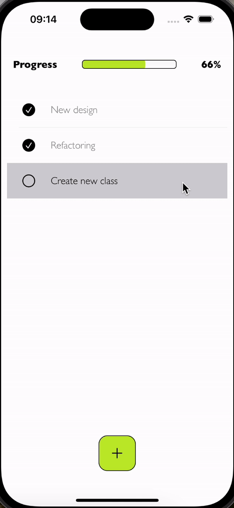

# ToDoList
Simple, nice app for notes. Uses CoreData for local storage.

Main features:

- **Main Screen**: Displays a list of tasks in a `TableView`, making navigation and management straightforward.
- **ProgressView**: Positioned at the top of the screen, it shows the overall progress of tasks completion.
- **Add Task Button**: Located at the bottom of the screen, it allows users to quickly add a new task.
- **Drag and Drop**: Enables reorganizing tasks through dragging and dropping, enhancing user interface dynamism.
- **Task Deletion**: Tasks can be deleted by swiping left, adding dynamic interaction to the interface.
- **UI/UX Design**: Personally designed the user interface and user experience, focusing on simplicity and usability to enhance user engagement.

## Technologies used

- Swift
- UIKit
- MVVM
- CoreData
- Alert Sheet
- ProgressView

## Screenshots

<table>
  <tr>
    <td>
      
Launch Screen

      
    </td>
    <td>
      
Add new task

      
    </td>
    <td>
      
To do list

      
    </td>
    <td>
      
Drag and Drop

      
    </td>
  </tr>
</table>
